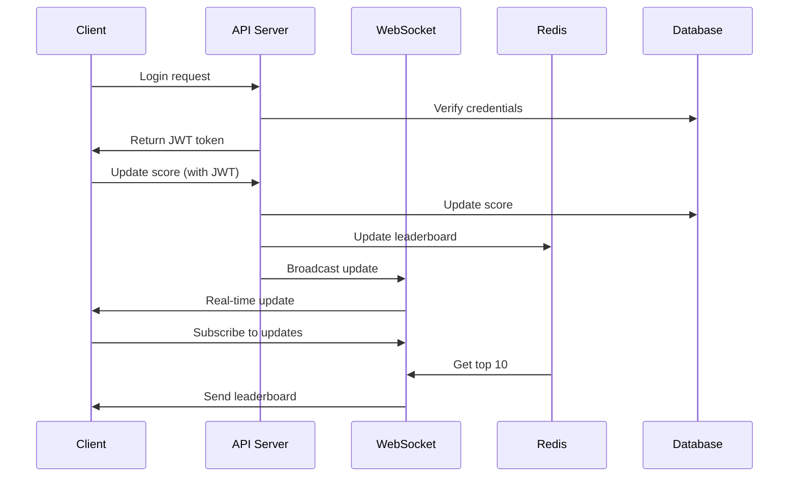

# Scoreboard API Module Specification

## Functional Requirements

1. **Scoreboard Display:**
   - Retrieve and return the top 10 users with the highest scores.
2. **Live Updates:**
   - Push real-time updates to the client (website) whenever a user's score changes.
3. **Score Update:**
   - Accept API requests to increment a user's score upon completing an action.
4. **Security:**
   - Prevent unauthorized score increases through user authentication and validation.

## Technical Requirements

- **Language:** Backend language of choice (e.g., Node.js with TypeScript recommended).
- **API Framework:** RESTful API (e.g., ExpressJS).
- **Real-Time Mechanism:** WebSocket for live updates.
- **Database:** Persistent storage (e.g., SQLite, MongoDB) to store user scores.
- **Security:** JWT (JSON Web Token) for authentication.

## API Endpoints

1. **Update Score:**

   - **Endpoint:** `POST /api/score/update`
   - **Request Body:**
     ```json
     {
       "userId": "string",
       "scoreIncrement": "number"
     }
     ```
     - **Headers:** `Authorization: Bearer <JWT_TOKEN>`
     - **Response:**
       - **Success:** `200 OK`
       ```json
       {
         "message": "Score updated"
       }
       ```
       - **Error:** `401 Unauthorized` or `400 Bad Request`
     - **Description:** Increments the user's score by the specified amount after validation.

2. **Get Top Scores:**
   - **Endpoint:** `GET /api/score/top`
   - **Response:**
     - **Success:** `200 OK`
     ```json
     {
       "message": "Top scores retrieved",
       "scores": [{ "userId": "string", "score": "number" }]
     }
     ```
     - **Error:** `401 Unauthorized` or `400 Bad Request`
   - **Description:** Returns the top 10 users with the highest scores.

## Security Measures

1. **Authentication:**
   - Use JWT with expiration time
   - Implement refresh token rotation
   - Rate limit API endpoints

2. **Prevent Cheating:**
   - Validate score increments
   - Limit the frequency of score updates
   - Detailed logging for suspicious activities

## Execution Flow

1. **Authentication:**
   - Client sends credentials for login
   - Server returns JWT token
   - Token is used for all subsequent requests

2. **Update Score:**
   - Client sends request with JWT token
   - Server validates token
   - Updates score in database
   - Updates Redis cache
   - Broadcasts changes via WebSocket

3. **Display Leaderboard:**
   - Client subscribes to WebSocket channel
   - Server sends top 10 players
   - Real-time updates when there are changes

## Diagram of Execution Flow



## Improvement Ideas

- **Scalability:** Consider a distributed database (e.g., Redis) for high traffic scenarios.
- **Leaderboard Caching:** Cache the top 10 scores in memory (e.g., Redis) to reduce database queries.
- **Error Handling:** Add detailed error messages for debugging (e.g., "Invalid token", "Score increment must be positive").
- **Logging:** Implement logging for score updates to monitor potential abuse.
